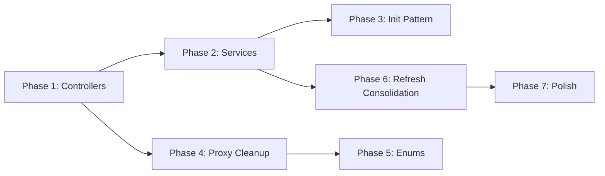

# Ritournelle Codebase Review

> **Scope**: Architecture, refactor progress, code quality, and actionable prescriptions.  
> **Audience**: Senior maintainers and future contributors.

---

## Executive Summary

The project is a **text-based Godot RPG** with solid foundational ideas: data-driven design, autoloaded systems, and a nascent controller pattern. However, the codebase is **mid-refactor** and currently sits in an awkward hybrid state:

- **Main.gd is still a god-object** (377 lines) despite controllers existing.
- **Controllers are inconsistently scoped**—some flows use them, others don't.
- **GameState.gd conflates orchestration with business logic** (415 lines of mixed concerns).
- **Signal wiring is scattered** between `Main.gd`, controllers, and panel `_ready()` blocks.

The junior developer made reasonable progress, but **left the refactor half-finished**. The result is confusion about "who owns what" and duplicated refresh/visibility logic across files.

---

## Diagnoses

### 1. Main.gd: God-Object Syndrome

| Symptom | Evidence |
|---------|----------|
| Owns all UI references | 14 `@onready` vars for panels, buttons, logs |
| Centralizes wiring | `_connect_buttons()` spans 35+ lines connecting signals from 6 panels |
| Handles business actions | `_on_harvest_pressed()`, `_on_combat_pressed()`, `_do_rest()`, `_do_craft()` |
| Controls visibility | `_refresh_visibility()`, `_refresh_open_panels()`, `_hide_sub_panels()`, `_set_action_buttons_enabled()` |

**Root cause**: The refactor introduced controllers but never migrated map/zone/node flows out of Main.

---

### 2. Inconsistent Controller Usage

Three controllers exist:

| Controller | Scope |
|------------|-------|
| `AccountController` | Account/character CRUD ✅ |
| `InventorySkillsController` | Inventory/skills overlays ✅ |
| `TownController` | Town intents (rest/craft/map) ✅ |

**Missing**:
- `MapController` (zone selection, travel)
- `ZoneController` (node movement)
- `NodeController` (harvest/combat/return)

Main.gd directly handles:
- `_on_map_zone_selected()` → `GameState.travel_to_submap()`
- `_on_move_to_node_requested()` → `GameState.move_to_node()`
- `_on_harvest_pressed()` / `_on_combat_pressed()` → `GameState.act_in_current_node()`

This inconsistency means future maintainers must check **both** Main.gd and controllers to understand any flow.

---

### 3. GameState.gd: Overloaded Orchestrator

| Role | Examples (Lines) |
|------|------------------|
| Account/character lifecycle | `create_account`, `select_character_by_name` (74-147) |
| Inventory queries | `get_equipped_entries`, `get_item_inventory_entries` (154-203) |
| Travel logic | `travel_to_submap`, `move_to_node`, `return_to_town` (256-313) |
| Action execution | `act_in_current_node`, `rest`, `start_craft` (205-337) |
| XP routing helpers | `_harvest_skill_for_submap`, `_combat_skill_for_equipped` (387-406) |

**Problem**: GameState is simultaneously a **session manager**, **travel service**, **action executor**, and **inventory facade**. This violates SRP and makes testing/extension painful.

---

### 4. Controller Initialization Pattern is Fragile

Controllers are initialized via massive `init()` calls with 4-6 Callable arguments:

```gdscript
_town_controller.init(
    town_panel,
    func(): _do_rest(),
    func(): _do_craft(),
    func(): _on_map_pressed(),
    func(): _on_inventory_pressed(),
    func(): _on_skills_pressed(),
    func(): _on_save_exit_pressed()
)
```

**Issues**:
- Order-dependent, no named parameters
- Callables reference private `_on_*` methods (tight coupling)
- No interface/contract enforcement

---

### 5. Panel Signal Wiring is Duplicated

Every panel re-emits `ActionBar` signals:

```gdscript
# ZonePanel.gd
action_bar.open_inventory.connect(func(): emit_signal("open_inventory"))
action_bar.open_skills.connect(func(): emit_signal("open_skills"))
action_bar.save_exit.connect(func(): emit_signal("save_exit"))
```

This boilerplate appears in:
- `MapPanel.gd`
- `TownPanel.gd`
- `ZonePanel.gd`
- `NodePanel.gd`

Panels shouldn't need to proxy `ActionBar` signals—controllers should wire them directly.

---

### 6. Refresh/Visibility Logic is Scattered

```
Main.gd:
  _refresh_status()           → Updates status label, calls controller.refresh_if_visible()
  _refresh_open_panels()      → Calls refresh() on visible panels, syncs controller
  _refresh_visibility()       → Hides panels if no character
  _set_action_buttons_enabled()→ Disables buttons if no character

AccountController:
  sync_visibility()           → Shows/hides AccountPanel

InventorySkillsController:
  refresh_if_visible()        → Refreshes inventory/skills if visible
```

Multiple refresh entry points make it easy to miss updates.

---

### 7. Hardcoded Strings Everywhere

```gdscript
GameState.start_craft("plank")           # Main.gd
GameState.travel_to_submap("town")       # Multiple files
GameState.act_in_current_node("harvest") # Main.gd
```

No enums or constants for action types, submap names, or recipe IDs.

---

### 8. Data Layer is Solid but Static

- `data/items.gd`, `data/maps.gd`, `data/recipes.gd` use `const` dictionaries with static getters.
- Good for simplicity, but loading from JSON/YAML would enable modding.

---

### 9. Core Models are Clean

`scripts/core/` is the **best part of the codebase**:

- `character.gd`: Proper serialization, equip logic, skill init
- `stats.gd`, `inventory.gd`, `skill.gd`: Focused, single-responsibility
- `from_dict()` / `to_dict()` used consistently

**These need minimal work.**

---

### 10. Minor Issues

| Issue | Location |
|-------|----------|
| No type hints on some arrays | `var entries: Array = []` should be `Array[Dictionary]` |
| `has_method()` checks at runtime | `if log_box.has_method("set_lines")` suggests interface ambiguity |
| Magic numbers | `_log_lines.size() > 50` (log cap), travel costs in dicts |
| EmptyFile `.uid` files cluttering | `*.gd.uid` files—consider gitignore |

---

## Prescriptions

### Phase 1: Complete the Controller Migration (1-2 days)

1. **Create `NavigationController`** to own map/zone/node flows:
   - Move `_on_map_zone_selected`, `_on_move_to_node_requested`, `_open_zone_panel`, `_open_node_panel` from Main
   - Wire `MapPanel.select_zone`, `ZonePanel.move_to_node`, `NodePanel.*` signals

2. **Create `ActionController`** to own harvest/combat/rest/craft:
   - Move `_on_harvest_pressed`, `_on_combat_pressed`, `_do_rest`, `_do_craft` from Main
   - Consolidate action execution into one place

3. **Main.gd target**: <100 lines (bootstrap + global refresh helpers only)

---

### Phase 2: Extract Services from GameState (2-3 days)

Split `GameState.gd` into:

| Service | Responsibility |
|---------|----------------|
| `SessionService` | Account/character lifecycle (`create_account`, `select_character`, etc.) |
| `TravelService` | `travel_to_submap`, `move_to_node`, `return_to_town`, exit costs |
| `ActionService` | `act_in_current_node`, `rest`, `start_craft`, XP routing |
| `InventoryFacade` | `get_equipped_entries`, `get_equipment_inventory_entries` (or move to `Inventory` model) |

`GameState` becomes a **thin facade** that holds session state and delegates to services.

---

### Phase 3: Standardize Controller Initialization

Replace Callable-heavy `init()` with:

```gdscript
class_name TownController extends Node

signal request_rest
signal request_craft
signal request_open_map
# ... etc

func init(panel: TownPanel):
    _panel = panel
    _panel.rest_pressed.connect(_on_rest)
    # ...

func _on_rest():
    emit_signal("request_rest")
```

Main (or a root Controller) connects to controller signals:

```gdscript
_town_controller.request_rest.connect(_do_rest)
```

Benefits:
- Controllers become **portable** (not bound to Main's private methods)
- Signal chains are inspectable in editor

---

### Phase 4: Eliminate Panel Signal Proxying

Option A: Controllers wire ActionBars directly

```gdscript
# NavigationController
func init(map_panel, zone_panel, node_panel):
    for panel in [map_panel, zone_panel, node_panel]:
        panel.get_node("ActionBar").open_inventory.connect(_on_inventory_requested)
```

Option B: Global signal bus for ActionBar intents

```gdscript
# signals.gd (autoload)
signal open_inventory_requested
signal open_skills_requested
signal save_exit_requested
```

ActionBar emits to bus; InventorySkillsController listens.

---

### Phase 5: Introduce Enums/Constants

```gdscript
# constants.gd (autoload or preloadable)
class_name GameConstants extends RefCounted

enum ActionType { HARVEST, COMBAT }
enum Submap { TOWN, LAKE, FOREST, MOUNTAIN }
enum Slot { WEAPON, HAT, ARMOR }

const SUBMAP_TRAVEL_COSTS := {
    Submap.TOWN: 10.0,
    # ...
}
```

---

### Phase 6: Consolidate Refresh Logic

Create a single `UIRefresher` or extend `GameState` with a `state_changed` signal:

```gdscript
# GameState.gd
signal state_changed

func _emit_change():
    emit_signal("state_changed")

# Main.gd
GameState.state_changed.connect(_refresh_all)
```

All mutations in GameState call `_emit_change()`. Main listens once.

---

### Phase 7: Optional Improvements

| Item | Effort | Payoff |
|------|--------|--------|
| Type hints (`Array[Dictionary]`, etc.) | Low | Better autocomplete, fewer runtime bugs |
| Load data from JSON instead of `.gd` | Medium | Mod support, easier balance tweaks |
| Remove `has_method()` checks | Low | Define proper interfaces or extend `Control` |
| Gitignore `*.uid` files | 1 min | Cleaner diffs |

---

## Recommended Prioritization



**Start with Phase 1 and 4**—they have the highest impact on code clarity with moderate effort.

---

## Conclusion

The codebase is not broken; it's **in progress**. The junior developer's instincts were correct (controllers, data separation, signal-based panels), but execution stopped midway. The prescriptions above will:

1. Make Main.gd thin and maintainable
2. Make GameState testable by extracting services
3. Make signal flow predictable and inspectable
4. Reduce boilerplate and magic strings

Estimated total effort: **5-8 developer days** for Phases 1-6.

---

*Review performed: 2025-12-11*


Refactoring Postmortem
Executive Summary
We successfully transformed a monolithic, tightly-coupled Godot codebase into a modular, service-oriented architecture. The primary focus was on decoupling logic from the UI (
Main.gd
) and the central state manager (GameState.gd), moving it into discrete Controllers and Services.

Achievements
Architecture: Implemented a variation of MVC. Controllers now handle UI events and delegate business logic to Services via a Facade (GameState).
Decoupling:
Main.gd
 size reduced significantly. It now acts as a composition root, wiring dependencies instead of implementing game logic.
TownController logic merged/distributed, removing unnecessary abstraction layers.
Communication:
Adopted SignalBus for global, cross-cutting events.
Removed "signal bubbling" (proxy signals) in UI panels.
Type Safety: Enforced strict typing (Array[String], Array[Dictionary]) across Core systems and Services to prevent runtime type errors.
Maintainability:
Introduced GameConstants to eliminate magic strings/numbers.
Standardized file structure and naming conventions.
Unresolved Issues / Technical Debt
Type Safety Gaps: While we fixed Array vs Array[Type], there may still be loose typing in Dictionary values (e.g., rewards dicts). Godot's Dictionary is untyped, so runtime validation is still needed at boundaries.
Autoload Dependencies: CraftingSystem and EncounterSystem remain as Autoloads. Ideally, these should be Services injected into GameState or ActionService to improve testability.
UI Tight Coupling: UI Panels (MapPanel, TownPanel, etc.) are still instances in Main.tscn passed by reference. A better approach would be for Controllers to instantiate their own views or generic UI logic.
Testing: No automated testing framework (like GUT) is currently set up, relying entirely on manual verification.
Future Steps & Best Practices
1. Code Sanitization
Linter: Integrate gdtoolkit (gdformatted, gdlint) into the workflow to enforce style verification.
Strict Typing: Continue converting Variant types to strict types where rigid interfaces exist.
Docstrings: Add documentation comments (GDScript 2.0 style) to all Service public methods.
2. Architecture Evolution
Dependency Injection: Move away from preload().new() inside classes. Pass dependencies via _init() or setup() methods to facilitate mocking.
Resources for Data: Convert items.gd and recipes.gd dictionaries into Resource files (ItemResource, RecipeResource). This leverages Godot's editor inspector and improves data safety.
3. Testing Strategy
Install GUT (Godot Unit Test).
Write unit tests for SessionService (account creation/selection) and Inventory logic first, as these are critical and logic-heavy.
